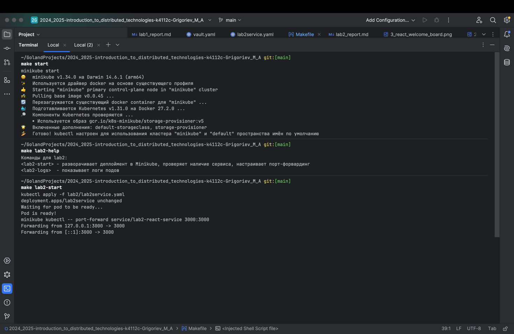
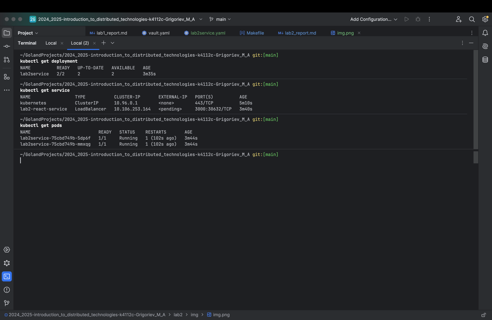
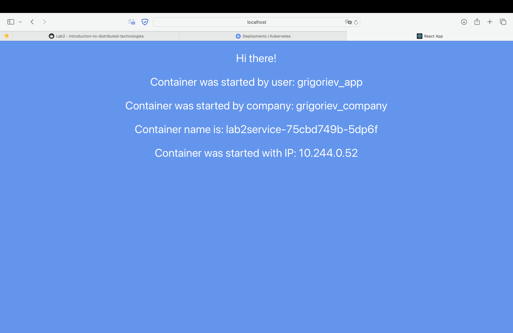
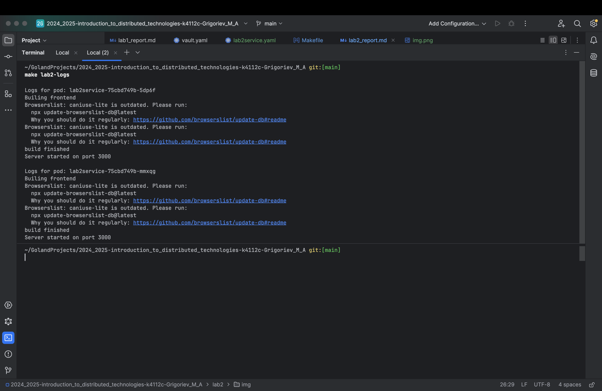
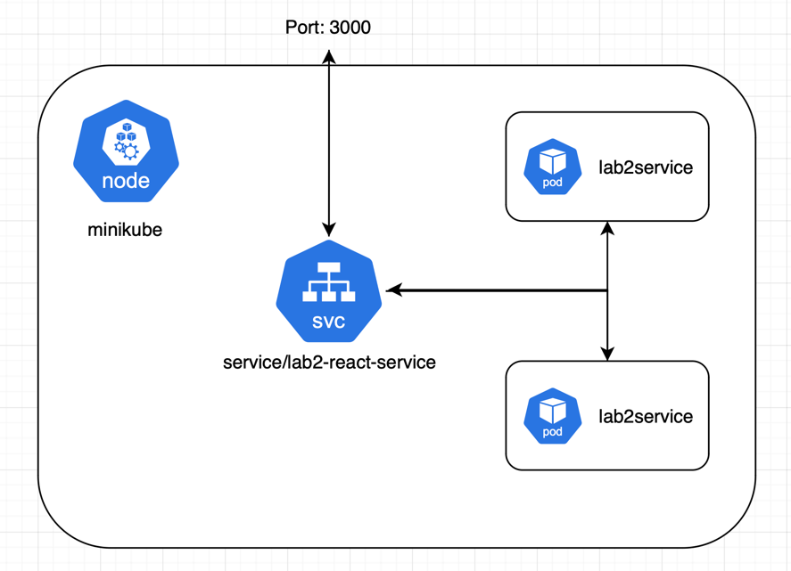

University: [ITMO University](https://itmo.ru/ru/)
Faculty: [FICT](https://fict.itmo.ru)
Course: [Introduction to distributed technologies](https://github.com/itmo-ict-faculty/introduction-to-distributed-technologies)
Year: 2024/2025
Group: K4112c
Author: Grigoriev Maxim Alexeyevich
Lab: Lab2
Date of create: 18.12.2024
Date of finished: //TODO

## Лабораторная 2

### Описание

В данной лабораторной работе вы познакомитесь с развертыванием полноценного веб сервиса с несколькими репликами.

### Цель работы

Ознакомиться с типами "контроллеров" развертывания контейнеров, ознакомится с сетевыми сервисами и развернуть свое веб приложение.

### Ход выполнения

1. Написан манифест (см. lab2/lab2service.yaml)
2. Выбран сервис LoadBalancer
3. Написан Makefile для удобства 
4. Запущен сервис и проверен

5. Схема
