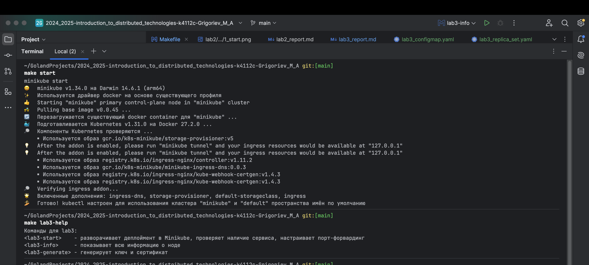
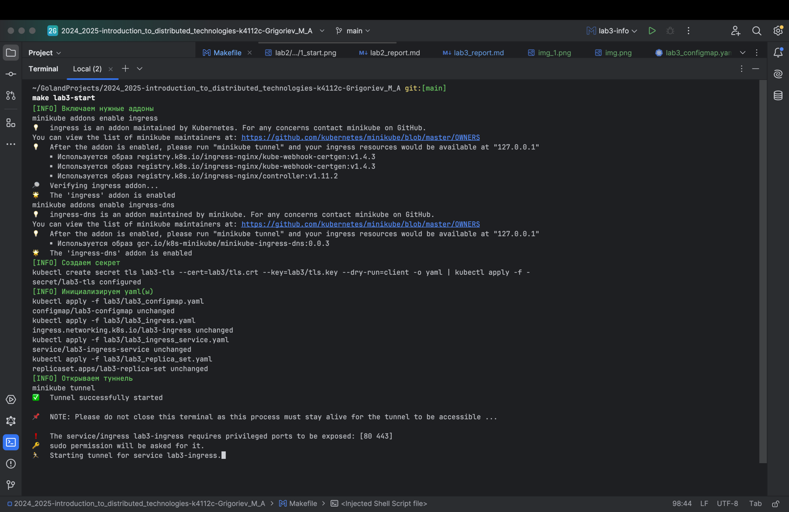
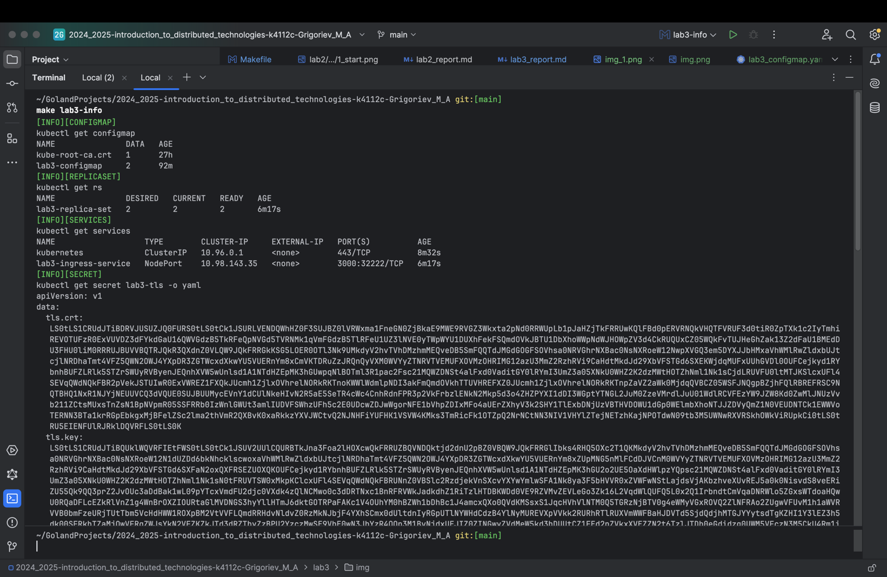
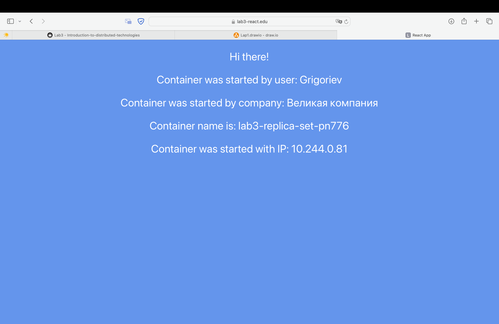
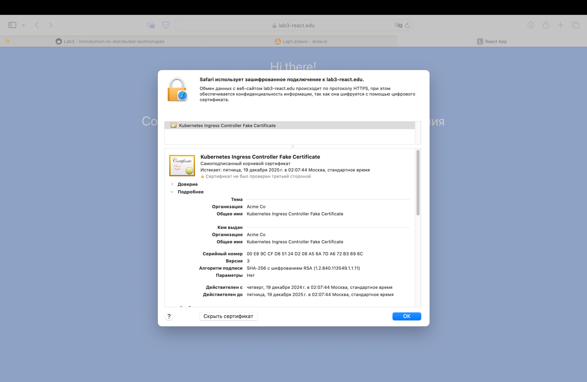
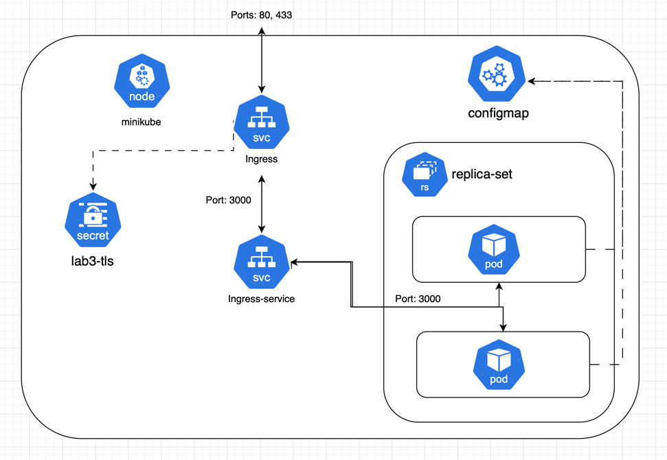

University: [ITMO University](https://itmo.ru/ru/) \
Faculty: [FICT](https://fict.itmo.ru) \
Course: [Introduction to distributed technologies](https://github.com/itmo-ict-faculty/introduction-to-distributed-technologies) \
Year: 2024/2025 \
Group: K4112c \
Author: Grigoriev Maxim Alexeyevich \
Lab: Lab3 \
Date of create: 18.12.24 \
Date of finished: //TODO

## Лабораторная 2

### Описание

В данной лабораторной работе вы познакомитесь с сертификатами и "секретами" в Minikube, правилами безопасного хранения данных в Minikube.

### Цель работы

Познакомиться с сертификатами и "секретами" в Minikube, правилами безопасного хранения данных в Minikube.

### Ход работы

1. Написал нужные манифесты (ConfigMap, Ingress, Service, ReplicaSet)
2. Включил аддоны ingress и ingress-dns
3. Сгенерировал сертификат и ключ с помощью openssl \
`openssl req -x509 -nodes -days 365 -newkey rsa:2048 -keyout tls.key -out tls.crt -subj "/CN=lab3.local/O=lab3"`
4. Создал секрет использующий сертификат и ключ \
`kubectl create secret tls lab3-tls --cert=tls.crt --key=tls.key`
   
   
   
5. Настроил DNS. В /etc/hosts прокинул запись \
`127.0.0.1       lab3-react.edu`
6. Запустил minikube tunnel
7. Проверил домен и TLS сертификат
   
   
8. Схема
   
